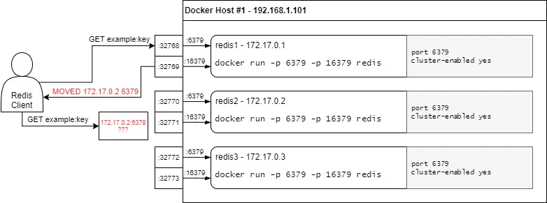
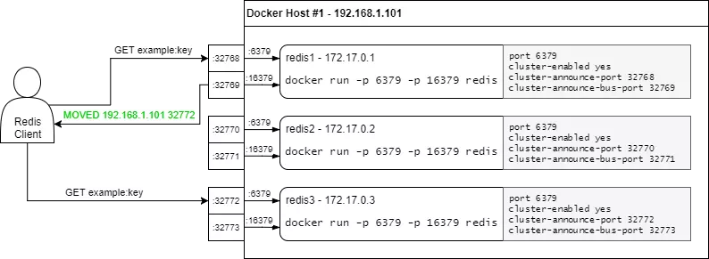

=======================
Redis 5 Docker集群配置
=======================
通用配置
========
Dockerfile 示例:
::
  #基础镜像
  FROM redis
  ##将自定义conf文件拷入
  COPY redis.conf /usr/local/redis/redis.conf
  ##修复时区
  RUN ln -sf /usr/share/zoneinfo/Asia/Shanghai /etc/localtime && \
       echo 'Asia/Shanghai' >/etc/timezone
  ## Redis客户端连接端口
  EXPOSE 6379
  ## 集群总线端口:redis客户端连接的端口 + 10000
  EXPOSE 16379
  ENTRYPOINT ["docker-entrypoint.sh"]
  CMD ["redis-server","/usr/local/redis/redis.conf"]

redis.conf 示例:
::
  # 客户端连接端口。
  # redis 需要两个端口。
  # 另一个 port+10000 的端口不用显示的设置，这个大的端口用于主从复制和集群内部通讯。
  port 6379
  daemonize no
  protected-mode no
  pidfile /var/run/redis.pid
  cluster-enabled yes
  cluster-config-file nodes.conf
  cluster-node-timeout 5000
  appendonly yes

  # NATted环境下需要配置以下三个
  # cluster-announce-ip ${IP}
  # cluster-announce-port ${PORT}
  # cluster-announce-bus-port 1${PORT}

docker-compose.yml 示例:
::
  version: "3.7"
  services:
    redis-1:
      image: redis:v3
      container_name: redis-1
      networks:
        net:
          ipv4_address: 172.18.0.2
    redis-2:
      image: redis:v3
      container_name: redis-2
      networks:
        net:
          ipv4_address: 172.18.0.3
    redis-3:
      image: redis:v3
      container_name: redis-3
      networks:
        net:
          ipv4_address: 172.18.0.4
    redis-4:
      image: redis:v3
      container_name: redis-4
      networks:
        net:
          ipv4_address: 172.18.0.5
    redis-5:
      image: redis:v3
      container_name: redis-5
      networks:
        net:
          ipv4_address: 172.18.0.6
    redis-6:
      image: redis:v3
      container_name: redis-6
      networks:
        net:
          ipv4_address: 172.18.0.7
  networks:
    net:
      ipam:
        config:
          - subnet: 172.18.0.0/24 

创建集群命令（宿主机方式）
::
  echo yes | docker run -i --rm --net redis_net redis:v3 redis-cli --cluster create \
    172.18.0.2:6379 172.18.0.3:6379 172.18.0.4:6379 172.18.0.5:6379 172.18.0.6:6379 172.18.0.7:6379 \
    --cluster-replicas 1
创建集群命令（容器内运行方式）
::
  docker run --rm --network redis_net -ti redis:v3 bash
  echo yes | redis-cli --cluster create \
      172.18.0.2:6379 172.18.0.3:6379 172.18.0.4:6379 172.18.0.5:6379 172.18.0.6:6379 172.18.0.7:6379 \
      --cluster-replicas 1

NATted的网络配置
================
在Redis Cluster集群模式下，集群的节点需要告诉用户或者是其他节点连接自己的IP和端口。
默认情况下，Redis会自动检测自己的IP和从配置中获取绑定的PORT，告诉客户端或者是其他节点。而Docker使用了一种称为端口映射的技术：在Docker容器中运行的程序可能会暴露出与程序所使用的端口不同的端口。这对于在同一服务器上同时使用同一端口运行多个容器很有用，因此在Docker环境中，如果使用的不是host网络模式，在容器内部的IP和PORT对外都是隔离的，那么宿主机外部的客户端或其他节点就无法通过此节点公布的IP和PORT建立连接。

如下图所示：

在redis 4.0以后加入了以下三个配置项：
::
  cluster-announce-ip：要宣布的IP地址。
  cluster-announce-port：要宣布的数据端口。
  cluster-announce-bus-port：要宣布的集群总线端口

如果配置了以后，Redis节点会将配置中的这些IP和PORT告知客户端或其他节点。而这些IP和PORT是通过Docker转发到容器内的临时IP和PORT的

redis 4.0中加入了配置项后：

redis.conf 示例:
::
  port 6379
  daemonize no
  protected-mode no
  pidfile /var/run/redis.pid
  cluster-enabled yes
  cluster-config-file nodes.conf
  cluster-node-timeout 5000
  appendonly yes

  # NATted环境下需要配置以下三个。
  # cluster-announce-ip ${IP}
  # cluster-announce-port ${PORT}
  # cluster-announce-bus-port 1${PORT}

docker-entrypoint.sh 文件示例
::
  #!/bin/sh
  set -e
  
  # first arg is `-f` or `--some-option`
  # or first arg is `something.conf`
  if [ "${1#-}" != "$1" ] || [ "${1%.conf}" != "$1" ]; then
          set -- redis-server "$@"
  fi
  
  # allow the container to be started with `--user`
  if [ "$1" = 'redis-server' -a "$(id -u)" = '0' ]; then
          find . \! -user redis -exec chown redis '{}' +
          exec gosu redis "$0" "$@"
  fi
  
  # 主要是加了以下三条命令，192.168.1.11为宿主机的IP。
  echo cluster-announce-ip 192.168.1.11 >> /usr/local/redis/redis.conf
  echo cluster-announce-port ${PORT} >> /usr/local/redis/redis.conf
  echo cluster-announce-bus-port 1${PORT} >> /usr/local/redis/redis.conf
  
  exec "$@"

host网络模式配置
=================
docker-compose.yml 示例
::
  version: "3.7"
  services:
    redis-1:
      image: redis:v3
      container_name: redis-1
      environment:
        - "PORT=7001"
      network_mode: host
    redis-2:
      image: redis:v3
      container_name: redis-2
      environment:
        - "PORT=7002"
      network_mode: host
    redis-3:
      image: redis:v3
      container_name: redis-3
      environment:
        - "PORT=7003"
      network_mode: host
    redis-4:
      image: redis:v3
      container_name: redis-4
      environment:
        - "PORT=7004"
      network_mode: host
    redis-5:
      image: redis:v3
      container_name: redis-5
      environment:
        - "PORT=7005"
      network_mode: host
    redis-6:
      image: redis:v3
      container_name: redis-6
      environment:
        - "PORT=7006"
      network_mode: host

redis.conf 示例
::
  # port 6379
  daemonize no
  protected-mode no
  pidfile /var/run/redis.pid
  cluster-enabled yes
  cluster-config-file nodes.conf
  cluster-node-timeout 5000
  appendonly yes

docker-entrypoint.sh 文件示例
::
  #!/bin/sh
  set -e
  
  # first arg is `-f` or `--some-option`
  # or first arg is `something.conf`
  if [ "${1#-}" != "$1" ] || [ "${1%.conf}" != "$1" ]; then
          set -- redis-server "$@"
  fi
  
  # allow the container to be started with `--user`
  if [ "$1" = 'redis-server' -a "$(id -u)" = '0' ]; then
          find . \! -user redis -exec chown redis '{}' +
          exec gosu redis "$0" "$@"
  fi
  
  # 主要是加了以下一条命令，配置redis服务的端口。
  echo port ${PORT} >> /usr/local/redis/redis.conf
  
  exec "$@"

创建集群命令,宿主机的IP是:192.168.9.130（容器内运行方式）
::
  docker run --rm --network redis_net -ti redis:v3 bash
  echo yes | redis-cli --cluster create 192.168.9.130:7001 192.168.9.130:7002 192.168.9.130:7003 192.168.9.130:7004 192.168.9.130:7005 192.168.9.130:7006 --cluster-replicas 1