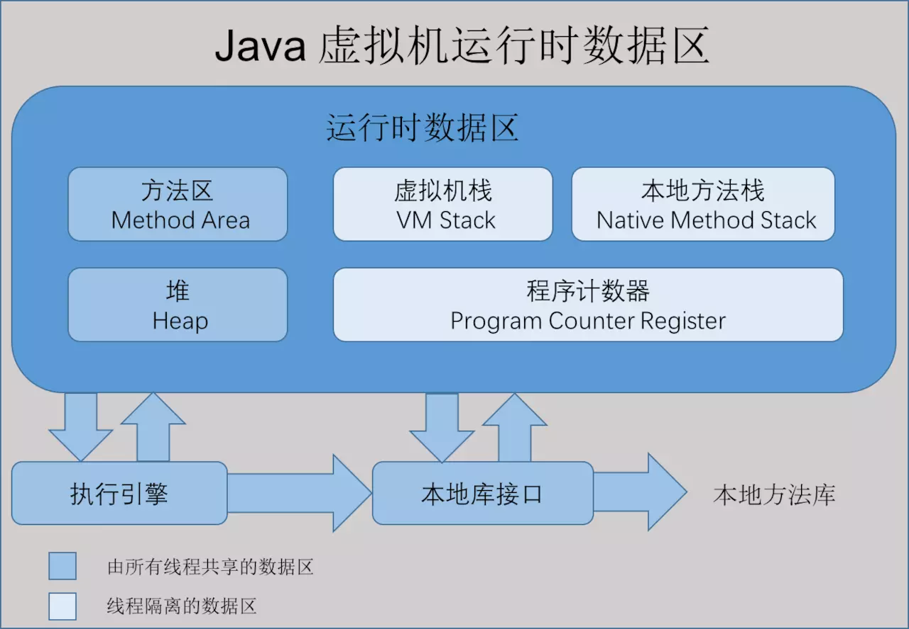

=========================
Java 内存区域与内存溢出异常
=========================
运行时数据区域
=============

程序计数器

    内存空间小，线程私有。字节码解释器工作是就是通过改变这个计数器的值来选取下一条需要执行指令的字节码指令，分支、循环、跳转、异常处理、线程恢复等基础功能都需要依赖计数器完成

如果线程正在执行一个 Java 方法，这个计数器记录的是正在执行的虚拟机字节码指令的地址；如果正在执行的是 Native 方法，这个计数器的值则为 (Undefined)。此内存区域是唯一一个在 Java 虚拟机规范中没有规定任何 OutOfMemoryError 情况的区域。

Java 虚拟机栈

    线程私有，生命周期和线程一致。描述的是 Java 方法执行的内存模型：每个方法在执行时都会创建一个栈帧(Stack Frame)用于存储局部变量表、操作数栈、动态链接、方法出口等信息。每一个方法从调用直至执行结束，就对应着一个栈帧从虚拟机栈中入栈到出栈的过程。

局部变量表：存放了编译期可知的各种基本类型(boolean、byte、char、short、int、float、long、double)、对象引用(reference 类型)和 returnAddress 类型(指向了一条字节码指令的地址)

StackOverflowError：线程请求的栈深度大于虚拟机所允许的深度。
OutOfMemoryError：如果虚拟机栈可以动态扩展，而扩展时无法申请到足够的内存。

本地方法栈

    区别于 Java 虚拟机栈的是，Java 虚拟机栈为虚拟机执行 Java 方法(也就是字节码)服务，而本地方法栈则为虚拟机使用到的 Native 方法服务。也会有 StackOverflowError 和 OutOfMemoryError 异常。

OutOfMemoryError：如果堆中没有内存完成实例分配，并且堆也无法再扩展时，抛出该异常。

堆Heap

   几乎所有的对象实例都在堆上分配内存。1.8后，字符串常量池从永久代中剥离出来，存放在堆中。堆有自己进一步的内存分块划分，具体划分请参见下图。
.. image:: images//堆.jpg

#. JAVA对象优先在Eden区分配，当Eden区没有足够的空间时触发一次Minor GC ，触发Minor GC时，Eden和from区中的存活对象会被复制到to区，然后from和to交换指针，以保证下次Minor GC时，to区还是空的，如果survival区无法容纳的对象将通过分配担保机制直接进入老年区
#. 分配担保机制可以通过HandlePromotionFailure配置，如果不允许的话，则直接发生FULL GC
#. 新生代(Young Generation)的最大大小将根据总堆的最大大小和NewRatio参数的值来计算。参数的“不受限制”默认值MaxNewSize意味着计算值不受限制，MaxNewSize除非MaxNewSize在命令行中指定了值
#. 一般情况下，不允许-XX:Newratio值小于1，即Old要比Young大
#. 大对象直接进入老年区的判断是根据PretenureSizeThreshold设置的阈值，所谓大对象时指需要大量连续内存空间的Java对象，最典型的大对象就是那种很长的字符串以及数组。

方法区

    属于共享内存区域,JAVA虚拟机规范把方法区描述为堆的一个逻辑部分，但是它却有一个Non-Heap的别名，用于存储已被虚拟机加载的类信息，常亮，静态变量， 即时编译器编译后的代码等数据。

用一张图来介绍每个区域存储的内容。
==============================
.. image:: images//java虚拟机运行时数据区2.webp    

jdk1.8中则把永久代给完全删除了，取而代之的是 MetaSpace。

元数据区

元数据区取代了1.7版本及以前的永久代。元数据区和永久代本质上都是方法区的实现。元空间与永久代之间最大的区别在于：元数据空间并不在虚拟机中，而是使用本地内存。

jdk8运行时数据区域

.. image:: images//jdk8内存模型图.jpg

运行时常量池

  运行时常量池（Runtime Constant Pool）是方法区的一部分属于方法区一部分，用于存放编译期生成的各种字面量和符号引用。Class文件中存储有常量池（Constant Pool Table），用于存放编译期生成的各种字面量和符号引用，这部分内容将在类加载后进入方法区的运行时常量池中存放。一般来说，处理保存Class文件中描述的符号引用外，还会把翻译出来的直接引用也存储在运行时常量池中。编译器和运行期(String 的 intern() )都可以将常量放入池中。内存有限，无法申请时抛出 OutOfMemoryError。

运行时常量池相对于Class文件常量池的另外一个重要特征是具备动态性。Java语言并不要求常量一定只有编译期才能产生

直接内存

    非虚拟机运行时数据区的部分

在 JDK 1.4 中新加入 NIO (New Input/Output) 类，引入了一种基于通道(Channel)和缓存(Buffer)的 I/O 方式，它可以使用 Native 函数库直接分配堆外内存，然后通过一个存储在 Java 堆中的 DirectByteBuffer 对象作为这块内存的引用进行操作。可以避免在 Java 堆和 Native 堆中来回的数据耗时操作。
OutOfMemoryError：会受到本机内存限制，如果内存区域总和大于物理内存限制从而导致动态扩展时出现该异常。

对象的创建
==========
虚拟机遇到一条new指令时，首先检查这个指令的参数是否能在常量池中定位到一个类的符号引用，并检查符号引用代表的类是否已被加载，解析和初始化过。如果没有就先执行类的加载过程。接下来虚拟机为新对象分配内存（指针碰撞或空闲列表，Serial,ParNew等带Compact过程的收集器时采用指针碰撞，CMS这种基于Mark-Sweep缩放的收集器时通常采用空闲列表）。
处理并发是通过CAS配上失败重试的方式或者每个线程在堆上预先分配本地线程分配缓冲（Thread Local Allocation Buffer,TLAB）。
内存分配完成后，虚拟机将内存空间都初始化为零值（不包括对象头）。然后对对象头数据进行设置。
在完成以上工作后，从虚拟机的视角来看，一个新的对象已经产生。但从Java程序的视角来看，在执行完new指令之后会接着执行<init>方法，把对象按照程序员的意愿进行初始化，这样一个真正可用的对象才算完全产生出来。

对象的访问定位
--------------
通过句柄访问对象
++++++++++++++

通过直接指针访问对象
+++++++++++++++++++

这两种对象的访问方式各有优势，使用句柄来访问的最大好吃就是reference中存储的是稳定的句柄地址，在对象被移动时只会改变句柄中的实例数据指针，而reference本身不需要修改
使用直接指针访问的最大好处就是速度快，它节省了异常指针定位的时间开销，由于对象的访问在Java中非常频繁，因此这类开销积少成多也是一项可观的执行成本。
HotSpot 是通过直接指针访问对象的方式进行对象访问的
