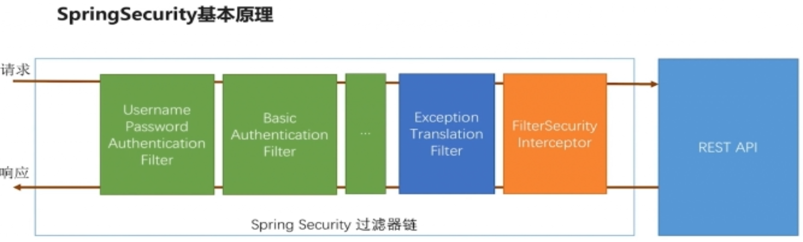

*****************
Spring Security笔记
*****************
Spring Security配置
=================

*实际开发中过滤器链中不止这三种过滤器，我们可以通过在过滤器链上增加绿色的过滤器来支持不同的身份认证方式，我们只可以通过配置决定绿色的这类过滤器哪个生效，另两种过滤器是不受控制的，它们一定会出现在指定的位置*

1. 写一个Security的配置类，继承 **WebSecurityConfigurerAdapter类，** 重写 **protected void configure(HttpSecurity http)** 方法.

.. code:: java

    @Override
    protected void configure(HttpSecurity http) throws Exception {
        http.formLogin()//配置使用表单登录
            .and()
            .authorizeRequests()//指定后面的是请求授权配置的内容
            .anyRequest()//所有请求
            .authenticated();//需要认证
    } 

2. 处理密码加密解密。配置密码加密器，在Security的配置类里加入以下内容。也可以自己实现PasswordEncoder接口，使用自己的加密方案。

.. code:: java

 @Bean
 public PasswordEncoder passwordEncoder() {
   return new BCryptPasswordEncoder();
 }

3. 处理用户校验的逻辑。写一个类实现UserDetails接口，在这个类里可判断用户帐户是否被删除，密码是否到期，帐户是否停用(锁定)，帐户是否到期等。Security有一个类实现了这个接口的类\ **User**。
4. 处理用户信息获取的逻辑。写一个类实现UserDetailsServie接口，实现接口的loadUserByUsername方法，实现类上要加@Component注解。

.. code:: java

 @Component
 public class KulvvUserDetailsService implements UserDetailsService {
    @Autowired
    private UserService userService;
    @Override
    public UserDetails loadUserByUsername(String s) throws UsernameNotFoundException {
        UserVO user = userService.getUserByUsername(s);
        return new User(user.getUsername(), user.getPassword(),
                AuthorityUtils.commaSeparatedStringToAuthorityList("admin"));
    }
 }

5. 自定义登录成功处理器，实现AuthenticationSuccessHandler接口
 Security 的实现类\ **SavedRequestAwareAuthenticationSuccessHandler**
6. 自定义登录失败处理器。实现AuthenticationFailureHandler接口
 Security 的实现类\ **SimpleUrlAuthenticationFailureHandler**
