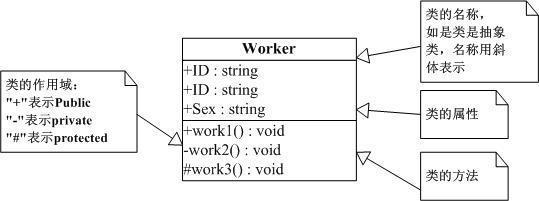

一、章节标题
=============
章节头部由下线（也可有上线）和包含标点的标题组合创建，其中下线要至少等于标准文本的长度

可以表示标题的符号有 =，- ，+，*，#，`，:，'，"，~，^，_，<，>

对于相同的符号，有上标是一级标题，没有上标是二级标题

标题最多分六级，可以自由组合使用

全加上标或者全不加上标，使用不同的6个符号的标题依次排列，则会依次生成的标题为H1-H6

示例
--------

一级标题
=================
二级标题
-----------------
三级标题
+++++++++++++
四级标题
_____________
五级标题
*************
六级标题
#############

二、段落
=========
段落是被空行分割的文字片段，左侧必须对齐（没有空格，或者相同的空格）

缩进的段落没视为引文

示例
------
这是一个段落

这是另一个段落

    这是一段引文

三、列表
=========
符号列表
---------
符号列表使用 -，+，*

下级列表需要有缩进空格

示例
++++++
- 列表1
- 列表2

  - 下级列表1
  - 下级列表2
- 列表3

  - 下级列表1
  - 下级列表2

顺序列表
---------
可以使用的顺序序号有：

* 阿拉伯数字：1,2,3 ...
* 大写字母A-Z
* 小写字母a-z
* 大写罗马数字：I, II, III, IV，V...
* 小写罗马数字：i,ii,iii,iv,v...

可以为序号添加前缀和后缀

* .后缀："1.","A.","a."
* ()抱起来："(1)","(A)","(a)"
* )后缀："1)","A)","a)"

顺序列表可以借助 # 自动生成顺序

示例
++++
1. 列表1
#. 列表2

A) 列表A
B) 列表B

四、文本代码
=============
文本代码都是以引用的形式展示的

.. code::

    这是一段引用的文本，文字将显示在一个方格框里面

五、粗体，斜体
===============
*斜体*

**粗体**

六. 超链接
===========
rst文件会为网址自动生成超链接

https://github.com/xxpasswd

这是我的python学习记录,请参考 `python web 学习 <https://python-web-study.readthedocs.io/zh_CN/latest/>`_

七、 引用
===========
图片引用， 将image后面的地址换为图片的地址

八、表格
=========
简单表
-------
限制:至少要有一列,而且第一行不能包含多行文本

示例
++++
========== =========== ==================================================================
属性名称   默认值      介绍
========== =========== ==================================================================
debug      false       要不要打印 logback内部日志信息，true则表示要打印。建议开启
scan       true        配置发送改变时，要不要重新加载
scanPeriod 1 seconds   检测配置发生变化的时间间隔。如果没给出时间单位，默认时间单位是毫秒
========== =========== ==================================================================

