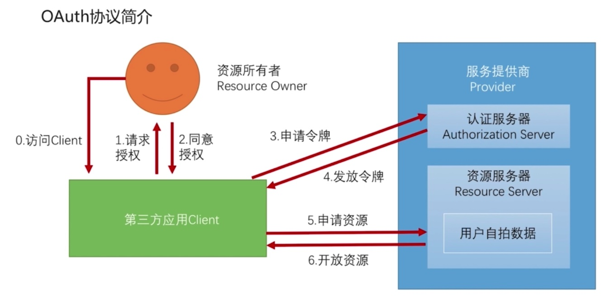
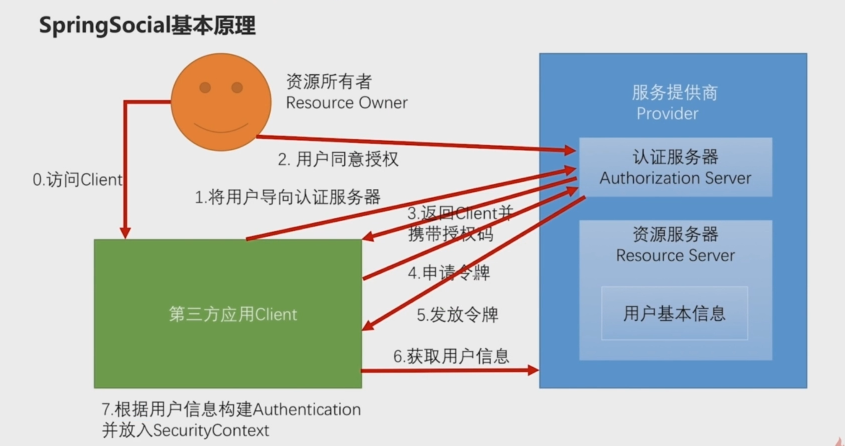
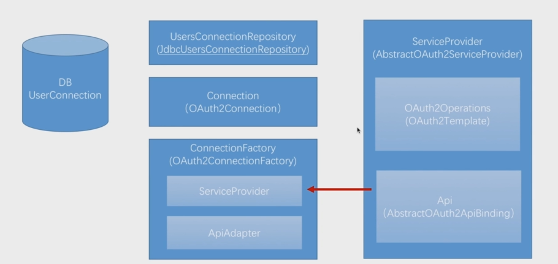

OAuth2授权码模式执行流程图
================

OAuth协议中的各个角色
------------------
* Third-party application：第三方应用程序，又称“客户端”（client），
* Service provider：服务提供商，
* Resource Owner：资源所有者，又称“用户”（user）。
* User Agent：用户代理，通常是浏览器。
* Authorization server：认证服务器，即服务提供商专门用来处理认证的服务器。
* Resource server：资源服务器，即服务提供商存放用户生成的资源的服务器。它与认证服务器，可以是同一台服务器，也可以是不同的服务器。

OAuth协议的执行流程：
--------------------
#. 用户打开客户端以后，客户端要求用户给予授权。
#. 用户同意给予客户端授权。
#. 客户端使用上一步获得的授权，向认证服务器申请令牌。
#. 认证服务器对客户端进行认证以后，确认无误，同意发放令牌。
#. 客户端使用令牌，向资源服务器申请获取资源。
#. 资源服务器确认令牌无误，同意向客户端开放资源。

Spring Social简介
================
Spring Security认证成功的标准是在SecurityContext中存储了用户相关的Authentication实例对象，也就是说当一个用户提供了正确信息给系统，系统带着用户的信息完成了一系列的校验后，校验通过后，将生成用户信息相关的Authentication存储到SecurityContext中。那么如果使用第三方登录，使用第三方如QQ、微信的用户信息进行登录验证，这是如何做到的呢？道理也是一样的，就是拿到第三方的用户信息，使用第三方的用户信息构建Authentication实例对象，并存储到SecurityContext中，而在获取第三方用户信息的时候，必须遵循OAuth协议，OAuth协议规定的流程，必须严格执行，那么Spring Social的作用就凸显了，它诞生的一个很大作用就是封装了OAuth协议规定的基础流程。

主要流程分为以下6个步骤：
-------------------
#. 用户访问客户端，客户端将用户导向认证服务器。
#. 认证服务器向客户端发送授权询问请求，用户选择是否给予客户端授权。
#. 假设用户给予授权，认证服务器将用户导向客户端事先指定的“重定向URI”（redirection URI），同时附上一个授权码。
#. 客户端收到授权码，附上早先的“重定向URI”，向认证服务器申请令牌。注意：这一步是在客户端的后台的服务器上完成的，对用户不可见，用户是无感的。
#. 认证服务器核对了授权码和重定向URI，确认无误后，向客户端发送访问令牌（access token）和更新令牌（refresh token）。
#. 获取用户信息

Spring Social已经将前五步封装了，开发者开发特定第三方登录验证，只需要实现第六步和第七步即可，最后组成一个SocialAuthenticationFilter集成到整个验证的过滤器链上，当用户选择第三方登录的时候，就会被该过滤器拦截，在过滤器中获取第三方用户信息，构建用户信息相关的Authentication实例对象并存储到SecurityContext中。
   
Spring social的接口和类
-------------------

* **ServiceProvider（AbstractOAuth2ServiceProvider）**：它是一个接口，它的存在就是为了适配不同的第三方服务提供商，比如QQ、微信等。如果我们需要开发QQ登录，那么我们就需要为QQ提供一个特定的ServiceProvider，而这个接口下有一个抽象实现AbstractOAuth2ServiceProvider，我们为QQ写ServiceProvider的时候只需要继承AbstractOAuth2ServiceProvider类即可。抽象类AbstractOAuth2ServiceProvider有两个属性OAuth2Operations和Api．
* **OAuth2Operations（OAuth2Template）**：它是一个接口，它封装了OAuth协议的前五步，也就是用户授权，直到应用拿到第三方应用（QQ、微信）的访问令牌，该接口有一个实现类OAuth2Template，OAuth2Template完成了访问第三方应用认证服务器、获取授权码、携带授权码申请令牌、获取令牌等核心步骤，在这里，我们需要做的仅仅是配置一些特定第三方认证服务器的URL即可，因为整个流程是遵循OAuth协议的，所以这些核心步骤需要携带的参数都是公共的，对开发者透明的。
* **Api（AbstractOAuth2ApiBinding）**：它主要是为了帮助开发者完成第六步的一个接口，由于每一个第三方应用的用户信息都是有区别的，比如用户头像的字段，在QQ里面叫head_image，也许到了微信里面，就叫image了，所以这里是一个个性化的开发区域，需要对每一个第三方服务提供商开发一个特定的类来实现用户数据的获取，这里Spring Social提供了一个抽象类AbstractOAuth2ApiBinding，尽可能地减少我们的开发成本，我们在开发获取用户信息的代码的时候，只需要继承这个抽象类即可。
* **Connection（OAuth2Connection）**: 它是一个接口，对第三方api返回的数据进行匹配，它封装了与用户相关的信息，这些信息，比如DisplayName（显示名称），ProfileUrl（主页地址），ImageUrl（头像地址）等基本信息，这些信息是Spring Social所规定的用户信息（固定结构的数据），它有一个实现类OAuth2Connection，
* **ConnectionFactory（OAuth2ConnectionFactory）**: 它是一个接口，它有一个实现类OAuth2ConnectionFactory，该类就可以完成对Connection的创建，而在OAuth2ConnectionFactory的构造方法中，就用到了ServiceProvider和ApiAdapter。ServiceProvider就是我们之前为特定第三方服务提供商编写的代码，它提供了从第三方服务提供商获取用户信息，ApiAdapter是一个适配器，主要是完成了从第三方服务提供商获取到的用户信息到Spring Social规定的用户信息的转换工作，这个适配器也是需要我们自己编写的内容之一。那么有了ServiceProvider和ApiAdapter，就可以构建OAuth2ConnectionFactory对象，那么就可以来创建Connection的实现类对象了。
* **UserConnection**：UserConnection是Spring Social规定的一张数据库表。它是专门用来记录第三方账户和业务系统内的账户之间的关系的一张表。
* **UsersConnectionRepository（JdbcUsersConnectionRepository）**: 它是一个接口，它专门封装了UserConnection表的一些基础操作，他有一个默认实现类JdbcUsersConnectionRepository，在该类的包下，有一个JdbcUsersConnectionRepository.sql文件，这个文件中有创建表的语句，需要我们自己拷贝出来创建对应的数据库表，该表名可以是UserConnection，也可以在该名称之前加上一个前缀。
.. code:: sql

   // 建表语句
  create table UserConnection (userId varchar(255) not null,
	providerId varchar(255) not null,
	providerUserId varchar(255),
	rank int not null,
	displayName varchar(255),
	profileUrl varchar(512),
	imageUrl varchar(512),
	accessToken varchar(512) not null,
	secret varchar(512),
	refreshToken varchar(512),
	expireTime bigint,
	primary key (userId, providerId, providerUserId));
  create unique index UserConnectionRank on UserConnection(userId, providerId, rank);

使用Spring Social集成QQ登录验证方式
=============================
一、开发获取用户QQ信息的接口
二、开发QQServiceProvider
三、开发ConnectionFactory