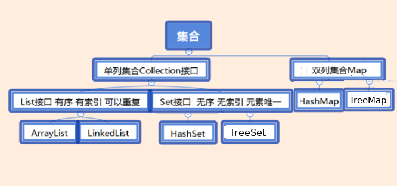

======
常用集合
======

Java中的集合层次结构分为单列集合(Collection)和双列集合(Map)。单列和双列的直接理解就是，集合的每个项能存储多少个数据。Collection以及它的子类在每个项中能存储一个数据，因此是单列集合。Map以及它的子类每个项中一次性能存储两个数据，键和值，因此是双列集合。

Collection是List，set和Queue接口的父接口，而Collections是一个操作集合的工具类。

* List , Set, Map都是接口，前两个继承至collection接口，Map为独立接口
* List下有ArrayList，Vector，LinkedList
* Set下有HashSet，LinkedHashSet，TreeSet
* Map下有Hashtable，LinkedHashMap，HashMap，TreeMap
* collection接口下还有个Queue接口，有PriorityQueue类

各个集合的特点:
=======
* List 有序,可重复．顺序就是对象插入的顺序，类似java数组，用户可通过使用索引来访问集合中的元素。
   + ArrayList
      - 底层数据结构是数组，查询快，增删慢。
      - 线程不安全，效率高，可以使用Collections工具类把ArrayList变成线程安全的。
   + Vector
      - 底层数据结构是数组，查询快，增删慢。
      - 线程安全，效率低
   + LinkedList
      - 底层数据结构是链表，查询慢，增删快。
      - 线程不安全，效率高
* Set 无序,唯一，集合中的对象不按特定方式排序，只是简单地把对象加入集合中，集合中不包含重复对象
   + HashSet 按照Hash算法来存储结合中的元素，因此具有良好的存取和查找的性能
      - 底层数据结构是哈希表。(无序,唯一)
      - 依赖两个方法：hashCode()和equals()来保证元素唯一性
   + LinkedHashSet 使用连表来维护元素，因为需要维护元素的插入顺序，所以性能略低，低于HashSet
      - 底层数据结构是链表和哈希表。(FIFO插入有序,唯一)
      - 由链表保证元素有序，由哈希表保证元素唯一
   + TreeSet 采用红黑树的数据结构来存储集合元素．注意：使用TreeSet时，保证添加的对象全都实现了Comparable接口，否则会添加失败，
      - 底层数据结构是红黑树。(唯一，有序)
      - 自然排序和比较器排序保证元素排序
      - 根据比较的返回值是否是0来保证元素唯一性
   + EnumSet 为枚举类设计的集合类。
      - 内部以向量的形式存储，存储形式非常紧凑，所有Enumset对象占用内存小，而且效率高。

   各Set实现类性能分析：HashSet性能总是高于TreeSet，如果想要保持排序的set，采用TreeSet。LinkedHashSet对于普通的插入删除来说比HashSet略微慢一点，但是有了连表，遍历LinkedHashSet会更快，EnumSet是Set实现类中性能最好的，但是只能保存同一类型的元素。并且所有的set实现类都是线程不安全的。

+ Map 提供key到value的映射，Map不能包含相同的key，每个key只能映射一个value。key决定了存储对象在映射中的存储位置，但不是由key对象本身决定的，通过散列技术进行处理。

  Map接口有三个比较重要的实现类，

  + HashMap 无序，不是线程安全，效率较高，允许null值
  + HashTable 无序，线程安全，效率较低，不允许null值
  + TreeMap 有序
  如果对同步性或与遗留代码的兼容性没有任何要求，建议使用HashMap。 

